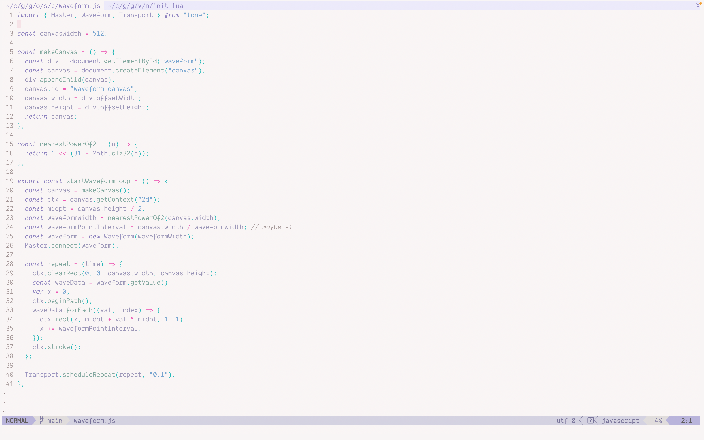

# \~ soft era \~

### syntax theme for [Neovim](https://www.neovim.io/)

🌸 Light pastel syntax theme matching the others at [soft-era](https://github.com/soft-aesthetic/soft-era), ported from [ soft-era-vim ](https://github.com/soft-aesthetic/soft-era-vim) 🌱



Uses [lush.nvim](https://github.com/rktjmp/lush.nvim/) for theme creation with colours copied from [ soft-era-vim ](https://github.com/soft-aesthetic/soft-era-vim) and [ soft-era-vscode ](https://github.com/soft-aesthetic/soft-era-vs-code).

Tries to support plugins that I use, which is why there are sections for telescope, which-key, and mini.indentscope, but if it doesn't play nicely with any other plugins then please feel free to create an issue/PR.

## Installation

### Lazy:
```lua
{
	"gilmoregrills/soft-era-nvim",
	lazy = false, -- make sure we load this during startup if it is your main colorscheme
	priority = 1000, -- make sure to load this before all the other start plugins
	config = function() -- not necessary if you're setting this somewhere else
		vim.cmd([[colorscheme soft-era]])
	end,
},
```

## Edits

Changes should be made to `lua/lush-theme/soft-era.lua`. If you have lush.nvim installed locally you can run `:Lushify` with the theme file open to see any changes in real time.

To build, you'll need [ shipwright ](https://github.com/rktjmp/shipwright.nvim) installed, once installed you can run `:Shipwright` in the root of the repo to build the theme files in the `colors/` directory.
